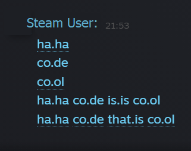
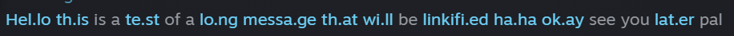
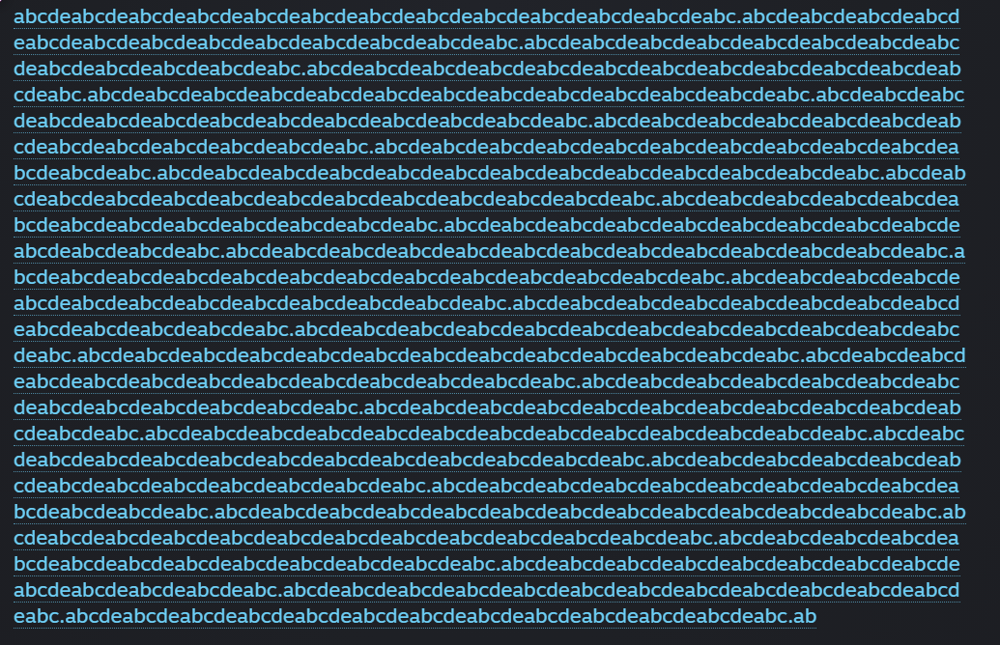

# make_steam_hyperlink.py

[->](ma.ke_ste.am_hyperli.nk.py) [ma.ke_ste.am_hyperli.nk.py](ma.ke_ste.am_hyperli.nk.py) [<-](ma.ke_ste.am_hyperli.nk.py)

Steam will automatically create a hyperlink in a chat message if it detects a valid URI scheme. This has gotten a little lenient and now doesn't even require defining a scheme or protocol like `https://`. A Fully Qualified Domain Name in a Steam chat message is just 2 characters: `ab`, a period: `.` , and 2 more characters: `ab` (i.e. a small hostname and a small Top Level Domain) to equal `ab.ab`. That's it. These are also inherently given an `http://` protocol, but that's a different story. 📚

This script creates hyperlinks that you can copy and paste into Steam chat messages for testing purposes. Change the configuration settings at the top of the script for testing, and just run it. Copy and Paste the output in your Steam chats and enjoy all of the things to click on. 🔗 

## tl;dr

Makes annoying hyperlinked messages to copy/paste into Steam chats. 💬

## Usage

1. Edit the file `make_steam_link.py`

2. Save your changes

3. Run the file `python3 make_steam_link.py`

## Example Output
The largest available hyperlink I've been able to make is 1986 characters with the following output:

```shell
Subdomain: abcdeabcdeabcdeabcdeabcdeabcdeabcdeabcdeabcdeabcdeabcdeabcdeabc.
Subdomain count: 31 / 31
Top Level Domain: ab
Total Message Length: 1986 / 5000

[*] Copy the Steam hyperlink below:

abcdeabcdeabcdeabcdeabcdeabcdeabcdeabcdeabcdeabcdeabcdeabcdeabc.abcdeabcdeabcdeabcdeabcdeabcdeabcdeabcdeabcdeabcdeabcdeabcdeabc.abcdeabcdeabcdeabcdeabcdeabcdeabcdeabcdeabcdeabcdeabcdeabcdeabc.abcdeabcdeabcdeabcdeabcdeabcdeabcdeabcdeabcdeabcdeabcdeabcdeabc.abcdeabcdeabcdeabcdeabcdeabcdeabcdeabcdeabcdeabcdeabcdeabcdeabc.abcdeabcdeabcdeabcdeabcdeabcdeabcdeabcdeabcdeabcdeabcdeabcdeabc.abcdeabcdeabcdeabcdeabcdeabcdeabcdeabcdeabcdeabcdeabcdeabcdeabc.abcdeabcdeabcdeabcdeabcdeabcdeabcdeabcdeabcdeabcdeabcdeabcdeabc.abcdeabcdeabcdeabcdeabcdeabcdeabcdeabcdeabcdeabcdeabcdeabcdeabc.abcdeabcdeabcdeabcdeabcdeabcdeabcdeabcdeabcdeabcdeabcdeabcdeabc.abcdeabcdeabcdeabcdeabcdeabcdeabcdeabcdeabcdeabcdeabcdeabcdeabc.abcdeabcdeabcdeabcdeabcdeabcdeabcdeabcdeabcdeabcdeabcdeabcdeabc.abcdeabcdeabcdeabcdeabcdeabcdeabcdeabcdeabcdeabcdeabcdeabcdeabc.abcdeabcdeabcdeabcdeabcdeabcdeabcdeabcdeabcdeabcdeabcdeabcdeabc.abcdeabcdeabcdeabcdeabcdeabcdeabcdeabcdeabcdeabcdeabcdeabcdeabc.abcdeabcdeabcdeabcdeabcdeabcdeabcdeabcdeabcdeabcdeabcdeabcdeabc.abcdeabcdeabcdeabcdeabcdeabcdeabcdeabcdeabcdeabcdeabcdeabcdeabc.abcdeabcdeabcdeabcdeabcdeabcdeabcdeabcdeabcdeabcdeabcdeabcdeabc.abcdeabcdeabcdeabcdeabcdeabcdeabcdeabcdeabcdeabcdeabcdeabcdeabc.abcdeabcdeabcdeabcdeabcdeabcdeabcdeabcdeabcdeabcdeabcdeabcdeabc.abcdeabcdeabcdeabcdeabcdeabcdeabcdeabcdeabcdeabcdeabcdeabcdeabc.abcdeabcdeabcdeabcdeabcdeabcdeabcdeabcdeabcdeabcdeabcdeabcdeabc.abcdeabcdeabcdeabcdeabcdeabcdeabcdeabcdeabcdeabcdeabcdeabcdeabc.abcdeabcdeabcdeabcdeabcdeabcdeabcdeabcdeabcdeabcdeabcdeabcdeabc.abcdeabcdeabcdeabcdeabcdeabcdeabcdeabcdeabcdeabcdeabcdeabcdeabc.abcdeabcdeabcdeabcdeabcdeabcdeabcdeabcdeabcdeabcdeabcdeabcdeabc.abcdeabcdeabcdeabcdeabcdeabcdeabcdeabcdeabcdeabcdeabcdeabcdeabc.abcdeabcdeabcdeabcdeabcdeabcdeabcdeabcdeabcdeabcdeabcdeabcdeabc.abcdeabcdeabcdeabcdeabcdeabcdeabcdeabcdeabcdeabcdeabcdeabcdeabc.abcdeabcdeabcdeabcdeabcdeabcdeabcdeabcdeabcdeabcdeabcdeabcdeabc.abcdeabcdeabcdeabcdeabcdeabcdeabcdeabcdeabcdeabcdeabcdeabcdeabc.ab
```

Likewise, the smallest is something like this:

```shell
Domain: oo.
Top Level Domain: ok
Total Message Length: 5 / 5000

[*] Copy the Steam hyperlink below:

oo.ok
```

and finally, **linkified** text will turn every word that is >= 4 characters long into a hyperlink. For example:

```shell
[*] Linkified message:

Th.is messa.ge wi.ll ha.ve be.en linkifi.ed
Plea.se downlo.ad th.is co.ol li.nk than.ks mu.ch
```

## Observations

The constraints seem to vary. What seems to be true is you need 5 total characters to create a link. You need two characters for the hostname and two characters for the Top Level Domain. The period is the 5th character.

I need to fix some vernacular for referring to the parts of a URL. I'm using "Subdomain" to refer to the hostname, but that's not correct. The hostname is the entire thing. The subdomain is the part before the hostname. The Top Level Domain is the part after the hostname. Some counts might be off because of this, but it's arbitrary.

## Valid Links







- `ha.ha`

- `co.co`

- `mo.us`

- `jo.in`

- `co.ol`

- `co.de`

- `abcdeabcdeabcdeabcdeabcdeabcdeabcdeabcdeabcdeabcdeabcdeabcdeabc.ab`

- ... and nearly all of your favorite 4-letter words that end in `ck`, `nt`, `ss`, etc.

- The possibilities are endless!

### Constraints

There are a few constraints that I've found, some are still being tested:

- The Subdomain can not be longer than 63 characters long

- I have notes of 126 maximum characters, but I can't seem to reproduce that. That's exactly 2x.

- The amount of subdomains is limited to 31

- I also have notes of only being allowed 15 subdomains

- The maximum amount of subdomains possible on the internet is capped at 500 so Steam doesn't come close to that.

- The Top Level Domain has to be valid, or on an allow list of sorts.

- Steams character count for a message is capped at **5000 characters**.

Do they differentiate domain length from subdomain? At what point does it halve the subdomains allowed? Further research required.

### Updates, Notes, and TODOs

```diff
+ Updated: You can now Linkify your Steam messages. Example output above.

+ Updated: Cleaned up vernacular around subdomain/domain/hostname.

TODO: Add more tests and more research into what I'm doing with my life.

TODO: Refactor into a class and add more functionality.

TODO: Make CLI version/argparse

- TODO: Make friends mad.
```